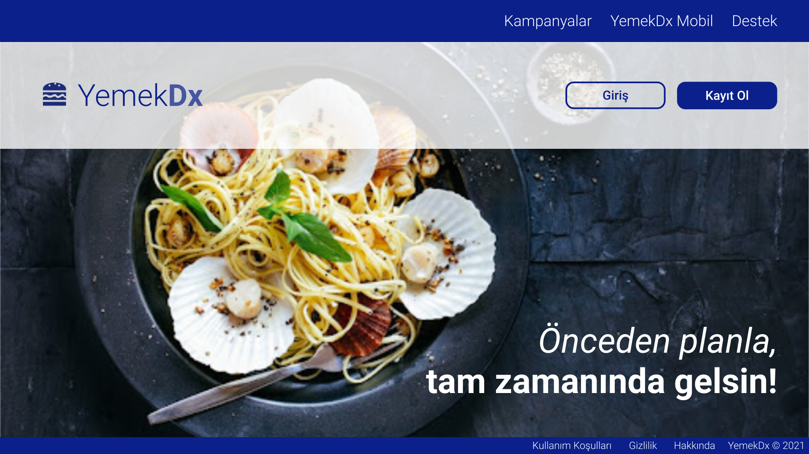
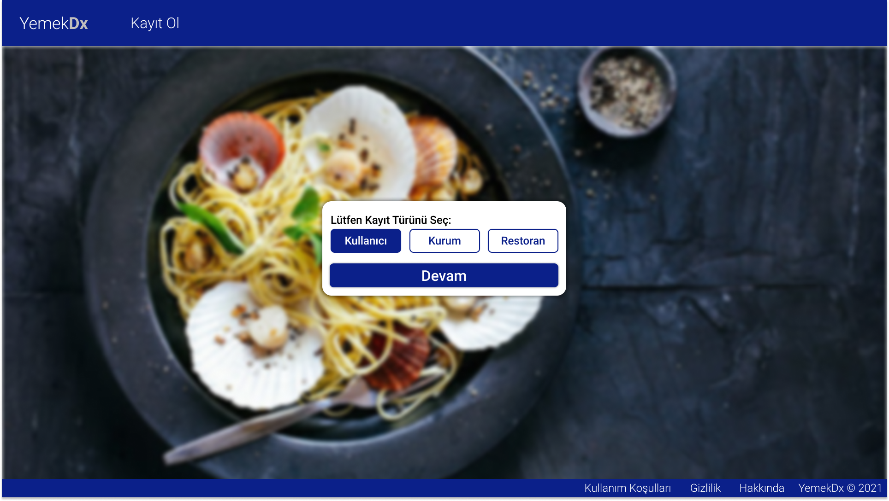
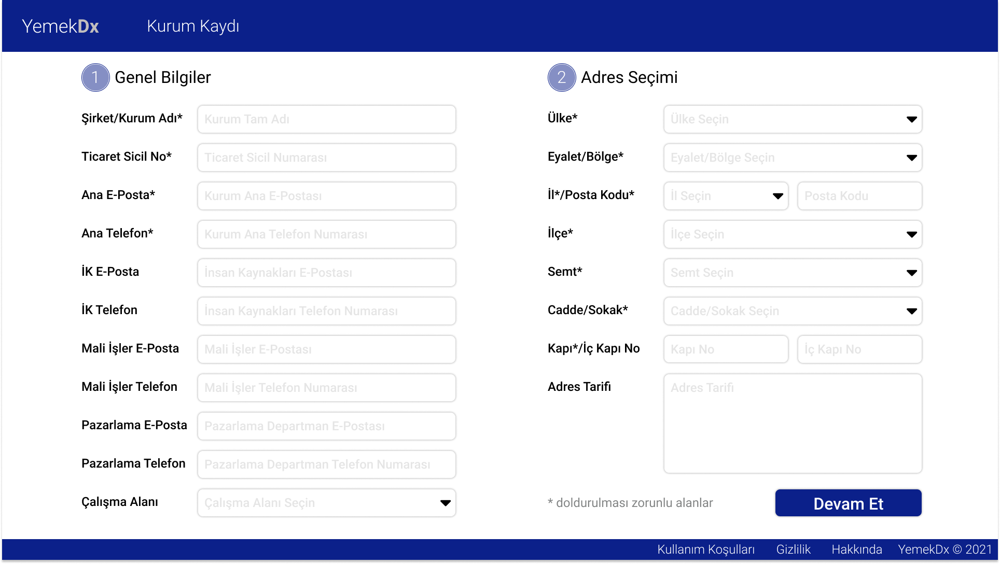
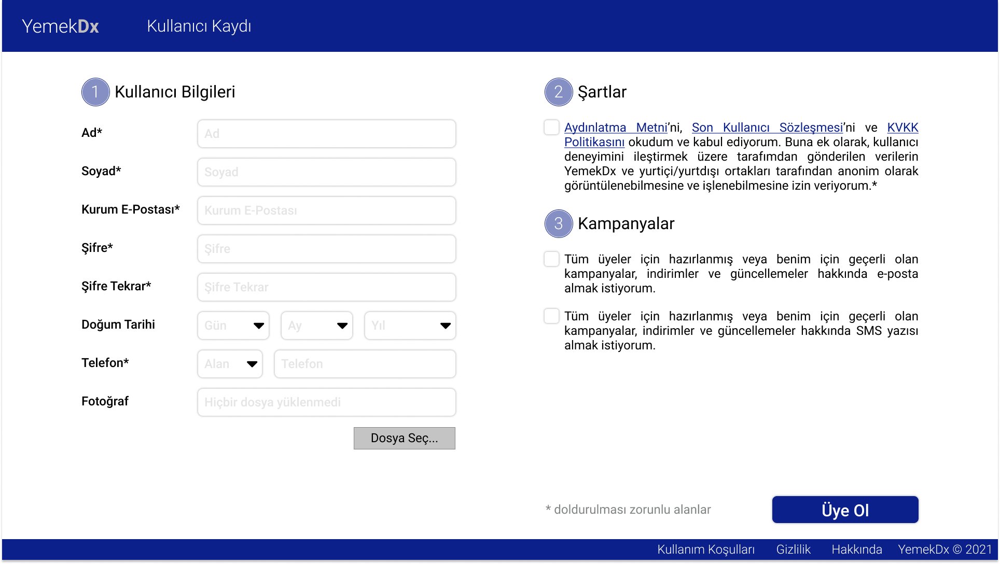
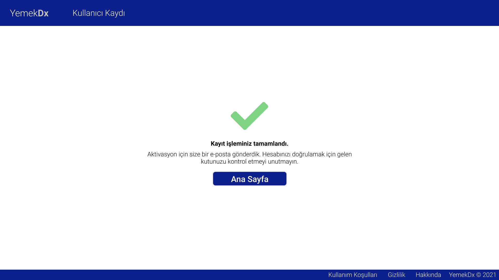
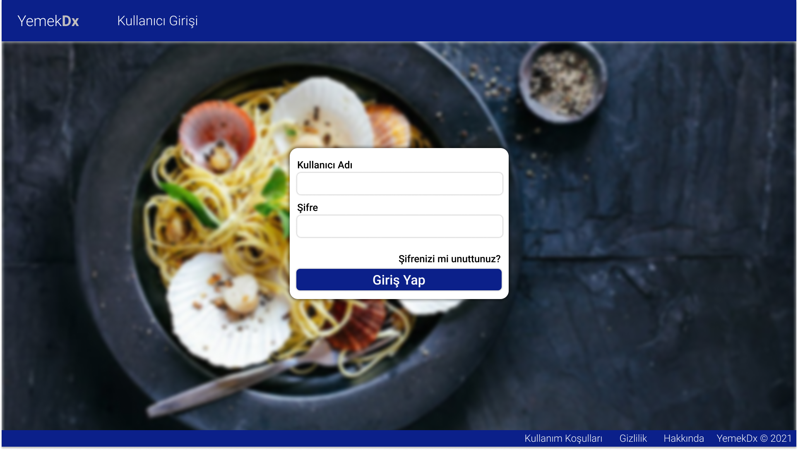
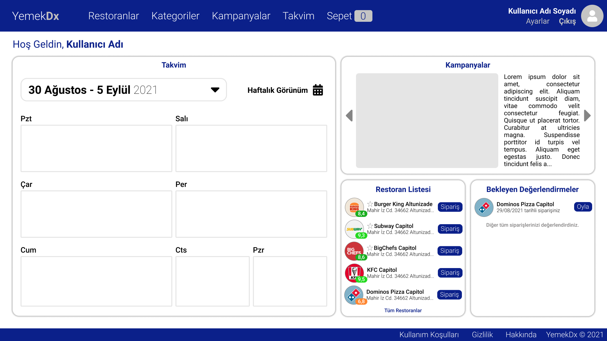
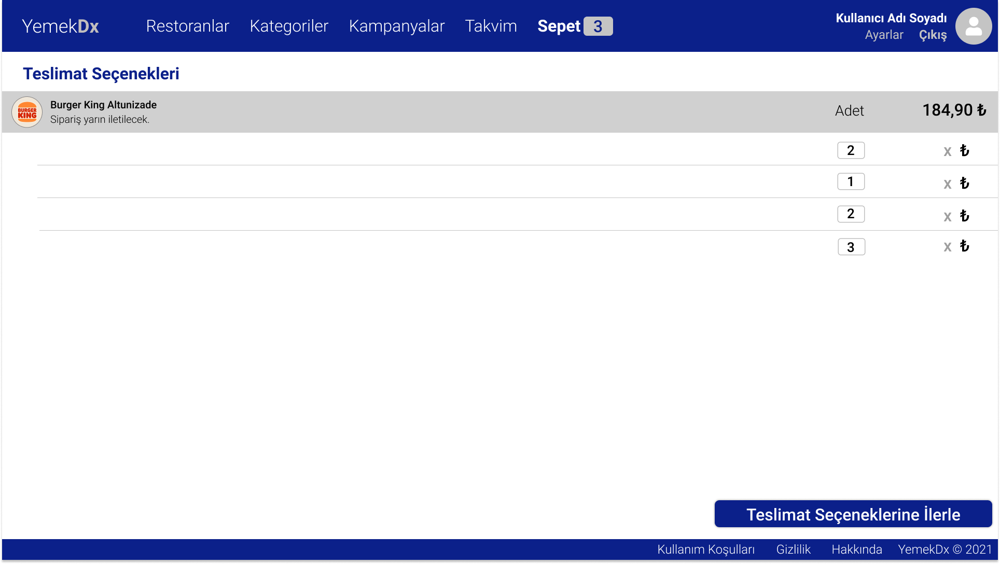
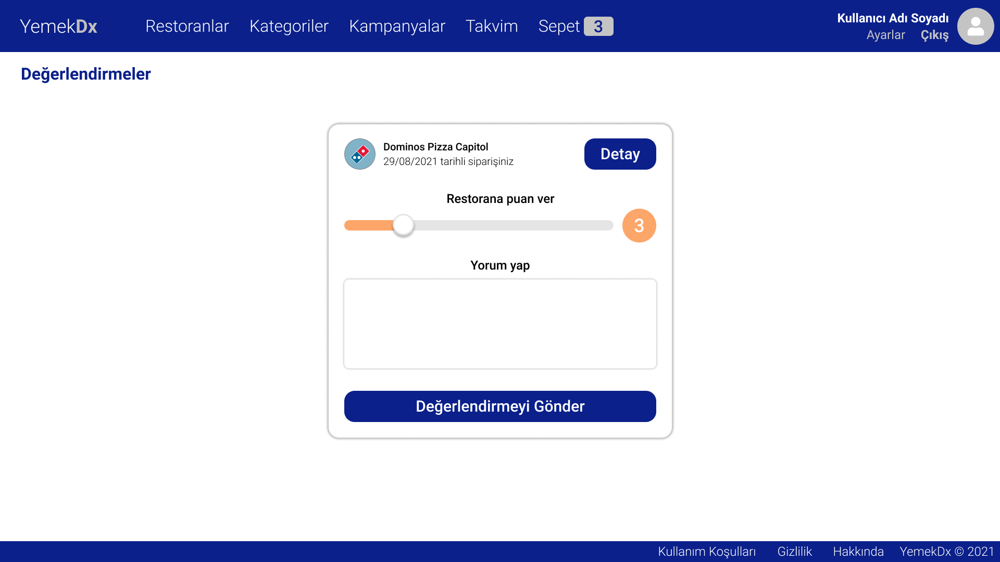
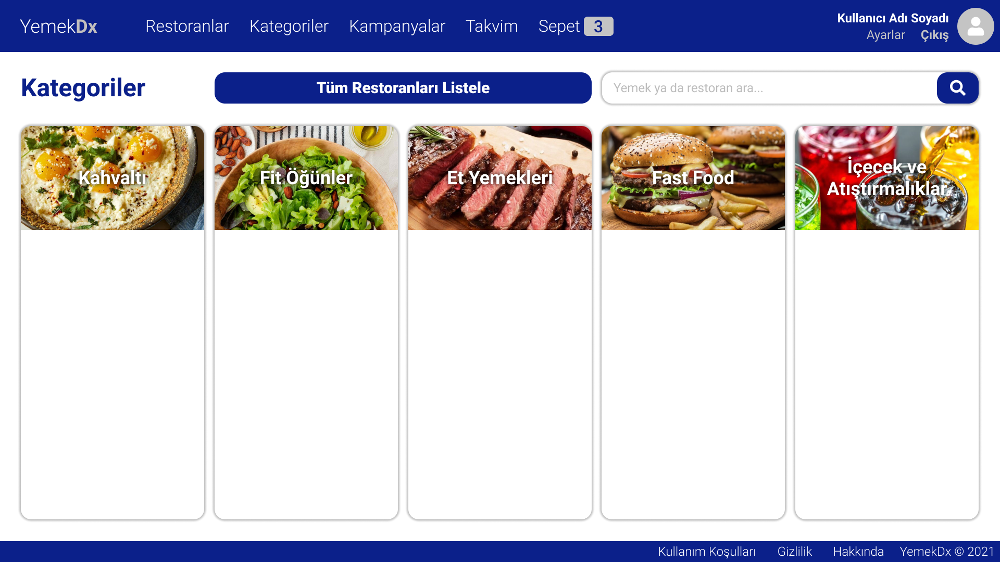

# YemekDx_UI
A Vue project made during SabancıDx internship.

The project's main idea is to plan any meal before than 7 days.
This was a solution created by our internship team for the company to deal with late orders.

The project was terminated.

## Installation and Run
To install, you should use the command below from the location of the project:
```
npm install
```
(Installation is needed only once.)

To run the project:
```
npm run serve
```

## Snapshots











